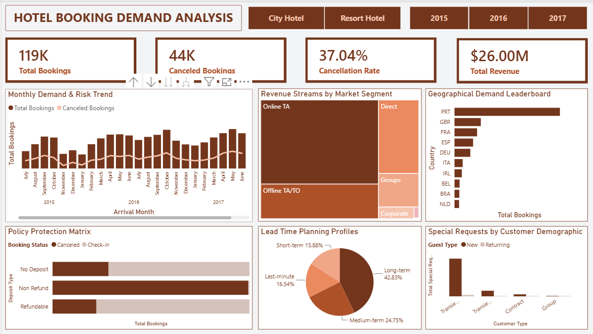

# Hotel Booking Demand & Revenue Analysis

## 📌 Project Overview
This project delivers an end-to-end business intelligence solution for hotel revenue management. Using a dataset of 119K reservations, I developed an executive-ready Power BI dashboard that analyzes booking trends, financial performance across market segments, cancellation risks, and customer demographics to maximize dynamic room yields.

## 🛠️ Tech Stack
* **Business Intelligence:** Power BI (DAX, Power Query)
* **Data Prep & Transformation:** Power Query

## 📊 Executive Dashboard Preview

*Figure 1: Finalized Executive Dashboard built with custom terracotta styling guidelines.*

---

## 📈 Strategic Insights & Actionable Recommendations

### 1. High-Level Performance Metrics (KPIs)
* **Insight:** The hotel received 119K total bookings generating $26.00M in revenue. However, a massive 44K bookings were canceled, leading to a high 37.04% cancellation rate. This structural leakage causes severe operational and supply-chain planning instability.
* **Recommendation:** Implement a predictive overbooking buffer of 12% to 15% during peak historical windows to offset the structural cancellation floor safely.

### 2. Monthly Demand & Risk Trend
* **Insight:** Booking volume displays sharp cyclical peaks in Spring (April–May) and Autumn (September–October). Crucially, cancellations scale linearly with traffic peaks, meaning peak seasons represent peak revenue risk.
* **Recommendation:** Trigger automated pre-arrival touchpoints (mobile check-in, dining upsells) 14 to 30 days before arrival during peak months to solidify guest commitment.

### 3. Revenue Streams by Market Segment
* **Insight:** Online Travel Agents (Online TA) generate the vast majority of booking volume, while Direct website bookings remain dangerously low. High OTA commissions (15% to 25%) are quietly eroding net margins.
* **Recommendation:** Launch an exclusive direct-booking campaign offering small, high-perceived-value perks (e.g., free breakfast or a complimentary late checkout) to convert OTA bookers into high-margin direct sales.

### 4. Geographical Demand Leaderboard
* **Insight:** Portugal (PRT) is the hotel's absolute primary core market, bringing in nearly 50K bookings and completely dwarfing secondary European pipelines like the UK and France. This creates high geographic vulnerability.
* **Recommendation:** Allocate 55% of localized digital ad budgets directly to regional Portuguese and British audiences, strategically timed with their specific local holiday calendars.

### 5. Policy Protection Matrix
* **Insight:** While "No Deposit" carries visible risk, "Non Refund" bookings paradoxically account for nearly 100% of cancellation volume. This signals a distribution anomaly where wholesale travel agencies dump room blocks back into the system when group flights fall through.
* **Recommendation:** Overhaul corporate contract templates to mandate a 25% non-refundable liquid cash deposit upfront on all massive group room blocks.

### 6. Lead Time Planning Profiles
* **Insight:** Long-term planners (90+ days) command 42.83% of total booking demand, meaning two-thirds of all guests lock in plans months in advance. This grants management an exceptionally clear long-range forecasting window.
* **Recommendation:** Maintain steady baseline pricing to lock in early bird occupancy, then dynamically scale rates upward as the arrival window shrinks to maximize yield from urgent last-minute arrivals.

### 7. Special Requests by Customer Demographic
* **Insight:** Standalone Transient (walk-in) customers submit the absolute highest volume of special requests (bed configurations, room views), driven almost entirely by first-time New Guests. Fulfilling these accurately dictates loyalty conversion.
* **Recommendation:** Provide the front desk with pre-arrival automated request assignment sheets 48 hours prior to check-in to ensure a flawless first impression and earn repeat business.
